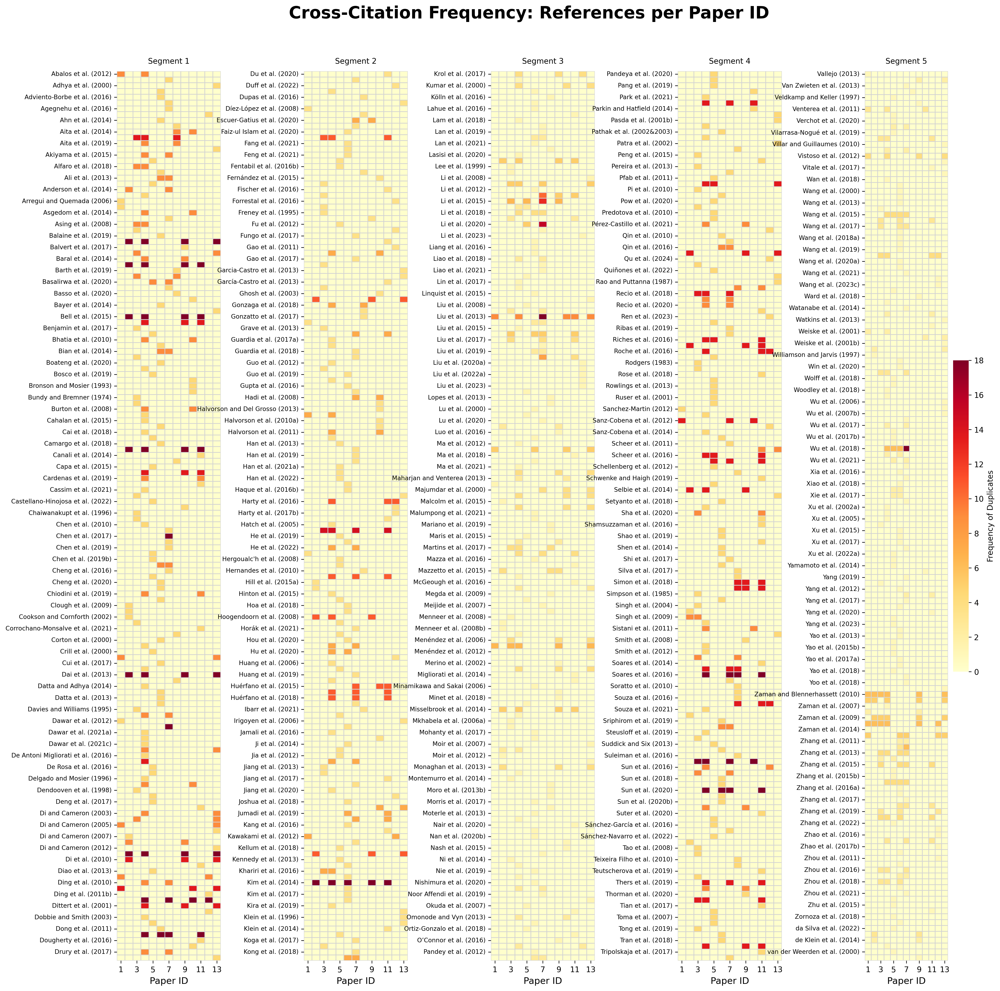

# Academic Literature Reference Overlap: Cross-Citation Analysis

##  Project Overview
Understanding the landscape of academic literature requires systematic analysis. When reviewing hundreds of academic sources, it becomes challenging to track which references are cited most frequently across different papers. 

This project explores cross-citation patterns and identifies duplicate references across a dataset of multiple research papers. The goal is to visualize this overlap clearly by mapping over 700 unique references to their respective Paper IDs to identify consensus and foundational studies within the dataset.

##  The Result: Heatmap Visualization
*(The visualization below organizes over 700 references into a 5-column "newspaper" layout to ensure the text remains perfectly readable without zooming).*



## Technical Approach
To achieve this, I developed a custom visualization pipeline using Python:
* **Data Processing:** Utilized `pandas` to clean the raw dataset and construct a pivot table, structuring the data into a strict matrix of References vs. Paper IDs.
* **Visualization:** Leveraged `seaborn` and `matplotlib` to generate the heatmap. 
* **Optimization:** Engineered a multi-column, side-by-side array layout to bypass the vertical limitations of standard heatmaps. The final output is mathematically constrained to a 4:5 aspect ratio for professional display.

## Python Code
Below is the complete, reproducible code used to generate the visualization:

```python
import math
import pandas as pd
import seaborn as sns
import matplotlib.pyplot as plt

def generate_reference_heatmap(file_path: str, output_path: str = 'reference_heatmap.png'):
    # 1. Data Ingestion & Cleaning
    df = pd.read_csv(file_path)
    df.columns = df.columns.str.strip()
    df_subset = df[['Paper ID', 'References', 'Duplicates']].dropna(subset=['Paper ID', 'References'])

    # 2. Matrix Transformation
    heatmap_data = df_subset.pivot_table(
        index='References', 
        columns='Paper ID', 
        values='Duplicates', 
        aggfunc='sum'
    ).fillna(0)

    # 3. Layout Configuration (4:5 Aspect Ratio)
    num_columns = 5
    rows_per_col = math.ceil(len(heatmap_data) / num_columns)
    
    fig, axes = plt.subplots(1, num_columns, figsize=(16, 20))
    plt.subplots_adjust(wspace=0.8, top=0.92)

    # 4. Iterative Plotting
    for i in range(num_columns):
        start_row = i * rows_per_col
        end_row = min((i + 1) * rows_per_col, len(heatmap_data))
        chunk = heatmap_data.iloc[start_row:end_row]
        
        is_last_col = (i == num_columns - 1)
        
        sns.heatmap(
            chunk, ax=axes[i], cmap='YlOrRd', linewidths=0.5, linecolor='lightgray',
            cbar=is_last_col,
            cbar_kws={"shrink": 0.4, "label": "Frequency of Duplicates"} if is_last_col else None
        )
        
        axes[i].set_title(f'Segment {i+1}', fontsize=14, pad=10)
        axes[i].set_xlabel('Paper ID', fontsize=12)
        axes[i].set_ylabel('') 
        axes[i].tick_params(axis='y', labelsize=8)
        axes[i].tick_params(axis='x', labelsize=10)

    fig.suptitle('Cross-Citation Frequency: References per Paper ID', fontsize=22, fontweight='bold')

    # 5. Export
    plt.savefig(output_path, format='png', dpi=300, bbox_inches='tight')
    plt.close()

if __name__ == "__main__":
    generate_reference_heatmap('Fina Data Sheet.xlsx - F&Final.csv')
